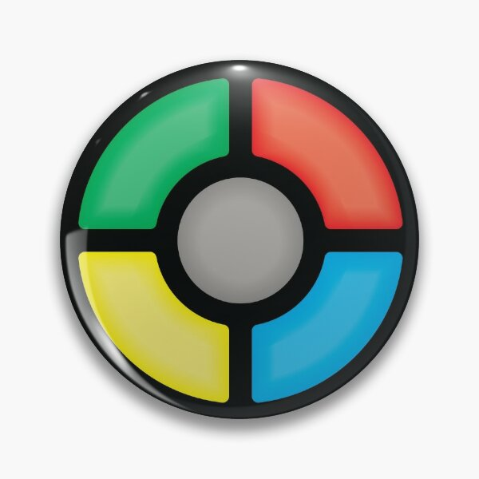

Using the Raspberry Pi Pico, a programmable microcontroller board, I created a replica of the classic "Simon Says" game. This is a memory game where the player has to push the right buttons corresponding to the random sequence of the LEDs. The sequence progressively gets longer, starting from 1 and ending at 8. The player instantly loses when the wrong button is pressed.

However, in this Simon Says game the order of buttons that must be pressed is based on a binary value. When the program starts, a number is rapidly incremented and then stops incrementing when a button is pressed, signaling the start of the game. This is to create a random large value. This value is converted to binary, and the values of the first 8 bits determine the final sequence of the LEDs. For example, a 1 will flash blue and a 0 will flash red. The circuit components required for this project were the programmed Raspberry Pi Pico board, LEDs, Push buttons, and resistors configured to act as pull-up resistors.

This project helped me become more proficient with implementing both software and hardware into one project, which is something I've never done before. It also helps to furthur improve my coding skills, as python was used to program the board.
