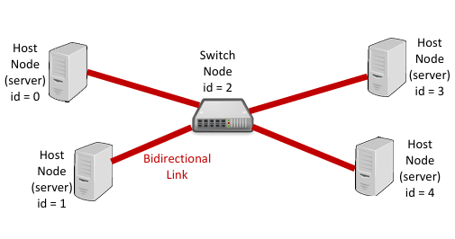

A local area network, or LAN, is a computer network that interconnects computers within an area such as a residence or school. In this EE 367 project, our team was given the code for a simple local area network with basic capabilities such as being able to ping another host and uploading a file to another host. The team was tasked to implement several improvements to the network, which were adding a switch node to the network as well as a simple domain name service (DNS) server. 

The first improvement was to add a switch node into the network. This makes the transfer of data between hosts more efficient because all the data is relayed to the switch node, then forwarded to the target destination. The switch node was implemented using a forwarding table, which records the IDs of the destination hosts and the ports to use when sending the packets. Pair programming proved to be a valuable technique in this project, as my partner and I were able to give eachother feedback and prevent many bugs in the code.

The next improvement was the implementation of a DNS server. The DNS server lets the user register a domain name for the host and interact with other hosts using their domain name. The functionality added with the domain name service was to be able to register a domain name, ping another host using their domain name, and download a file from another host using their domain name. Once again, my partner and I were responsible for implementing this change and utilized pair programming to achieve successful results.

From this project, I have expanded my knowledge on computer networks and how they operate on the lowest level. I have also learned how to better analyze code that is not mine. Finally, I have improved on my ability to work with a team.

Source: <a href="https://github.com/donnie-ca/EE367Lab7DNS"><i class="large github icon "></i>donnie-co/EE367Lab7DNS</a>

